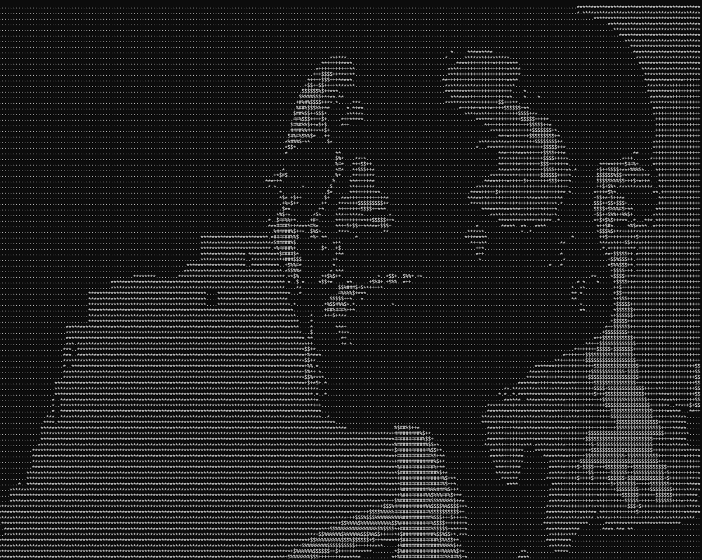

# ImageToASCII
Test python project made for fun. Simple console app allows you to convert image to ACII coded text banner

# Usage:
  `aska.py -i <image path>`
  - Provide -x <int size> and -y <int size> to specify output resolution
  - Provide -c <float multiplyer> to adjust image contrast for better convertion
  - Provide -b <float multiplyer> to adjust image brightness for better convertion

`symbols.txt` contains symbols used for conversion. Replace those for more personalized results

# Examples:

original: 

`>> py aska.py -i Docs/chadus.jpeg -x 250 -y 120 -c 3`

console screenshot of the output: 

# Known issues:

* At different aspect ratios output gets trimmed